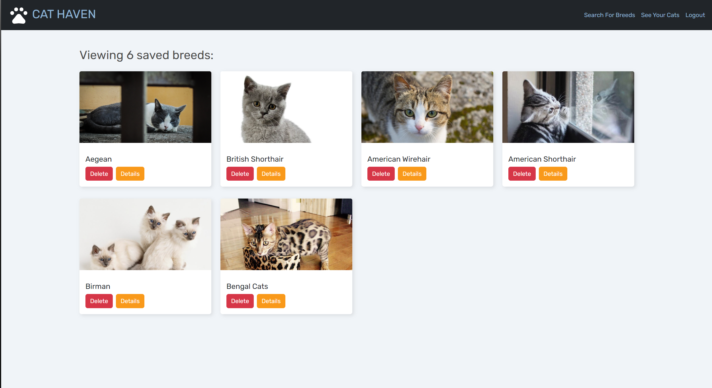

# Final Project- Cat Shelter

## Description

This project is designed as a user-friendly platform for individuals looking to adopt a cat. Its purpose is to connect potential pet parents with shelter cats by providing detailed information about the available breeds and their specific traits. Each breed will have a dedicated page with essential details such as personality traits, care requirements, health considerations, and compatibility with different households (e.g., families with kids, other pets, or first-time owners). 

## Key Features

- **Front-End:** Developed using React to provide a dynamic and responsive user interface.
- **Back-End:** Built with Node.js and Express.js, incorporating GraphQL for data queries and mutations.
- **Database:** MongoDB with Mongoose ODM for efficient data storage and retrieval.
- **Authentication:** Secure user authentication implemented with JSON Web Tokens (JWT).
- **Deployment:** Fully deployed on Render with live data integration.
- **Interactivity:** Interactive features that accept and respond to user input in real-time.
- **Responsiveness:** Designed to adapt seamlessly across devices and screen sizes.
- **Security:** Sensitive API key information securely managed on the server.


## Technologies Used

### Front-End
- React

### Back-End
- Node.js
- Express.js
- GraphQL

### Database
- MongoDB
- Mongoose ODM

### Authentication
- JSON Web Tokens (JWT)

### Deployment
- Render

### Other Tools
- CSS and React-Bootstrap for styling
- JavaScript for logic and interactivity

## Installation Instructions

1. Clone the repository:
   ```bash
   git clone https://github.com/Nikky0910/Project-3
   ```
2. Navigate to the project directory:
   ```bash
   cd Project-3
   ```
3. Install dependencies for the server and client:
   ```bash
   npm install
   cd client && npm install
   ```
4. Set up environment variables in a `.env` file in the root directory:
   ```plaintext
   MONGODB_URI=your_mongodb_uri
   JWT_SECRET=your_jwt_secret
   API_KEY=your_api_key
   ```
5. Start the development servers:
   ```bash
   npm run dev
   ```

## Deployment

This project is deployed on Render. You can access the live application here: [Deployed Link]

## File Structure

```
project-directory/
|-- client/
|   |-- src/
|   |   |-- components/
|   |   |-- pages/
|   |   |-- utils/
|   |   |-- App.js
|   |   |-- index.js
|-- server/
|   |-- models/
|   |-- schemas/
|   |   |-- resolvers.js
|   |   |-- typeDefs.js
|   |-- server.js
|-- .env
|-- package.json
```

## Contributions

Contributions to this project are welcome! Please follow the guidelines below:
1. Fork the repository.
2. Create a new branch:
   ```bash
   git checkout -b feature/your-feature-name
   ```
3. Commit your changes:
   ```bash
   git commit -m "Add your message here"
   ```
4. Push to the branch:
   ```bash
   git push origin feature/your-feature-name
   ```
5. Submit a pull request.

## Usage

Link to the GitHub repository:

<a href = "https://github.com/Nikky0910/Project-3"> Github Repo</a>

Link to the deployed application: 

<a href = "https://project-3-8krb.onrender.com"> Cat Shelter website</a>

The live website should look as follows:


 


## License

[](https://opensource.org/licenses/MIT)